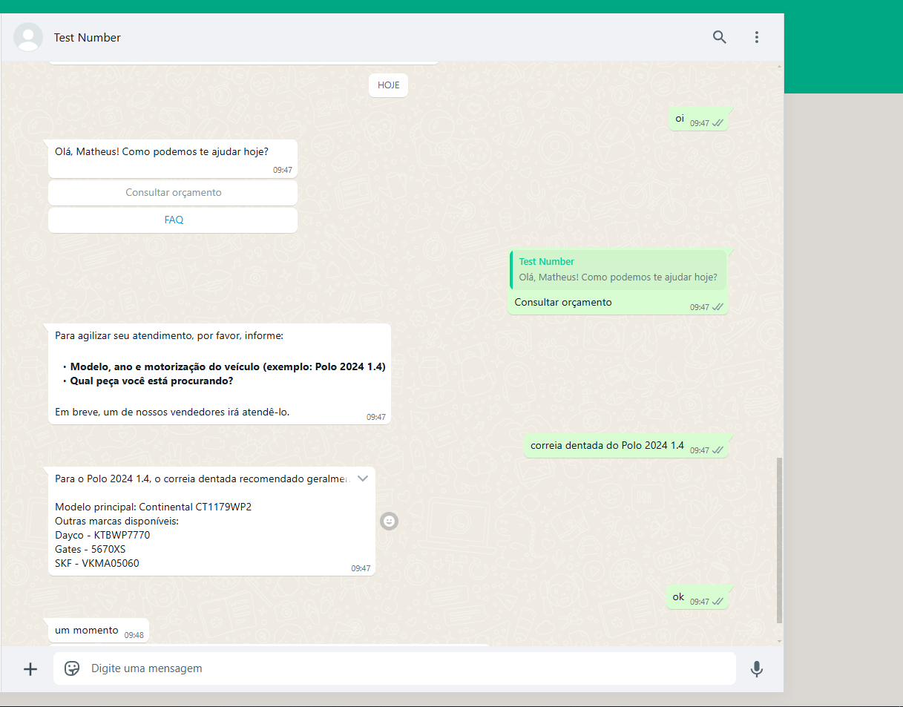
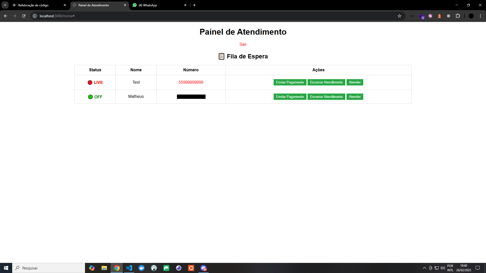
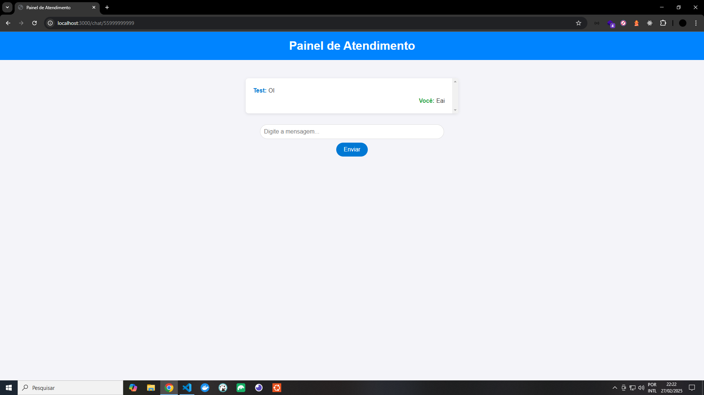
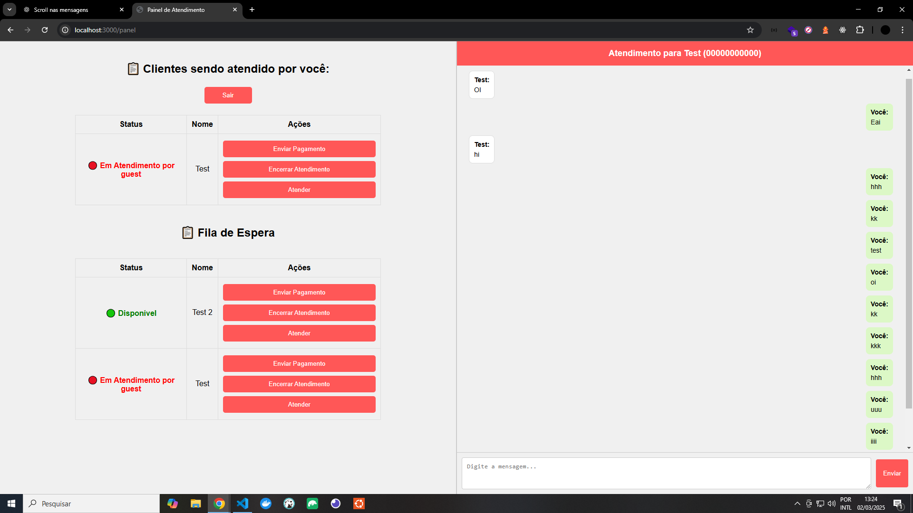
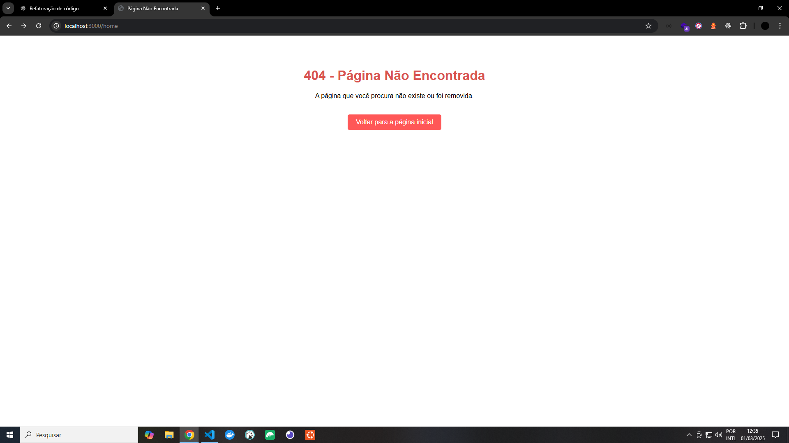

[](https://twitter.com/t_h_e_u)
[](https://www.linkedin.com/in/matheusgbatista/)
[](https://t-heu.github.io)

# WPP Bot Ecommerce

Automatize seu atendimento no WhatsApp com o WPP Bot Ecommerce.

## 🖼️ Preview








- Encerra conversa por inatividade
- Evita cliente tentar sair do fluxo da conversa

## 📌 Configuração do Ambiente (.env)

Crie e configure o arquivo .env com as seguintes variáveis:
```
Meta_WA_accessToken=
Meta_WA_SenderPhoneNumberId=
VERIFY_TOKEN_SECRET=testwpp
```

## 🚀 Configuração do NGROK e Servidor

1. Instale as dependências do projeto:
```
npm install
```

2. Exponha seu servidor local com o NGROK (para rodar no modo dev):
```
ngrok http 3000
```
O NGROK fornecerá uma URL semelhante a:

https://abc123.ngrok.io -> http://localhost:3000

3. Inicie o servidor local:

```sh
npm run start
```

## 🔗 Configuração do Webhook (Meta)

Configure o Webhook para integrar com a API do WhatsApp.

1. Em "WhatsApp > Configuração" no campo "URL de callback", insira a URL gerada pelo NGROK seguida do endpoint /webhook:

Exemplo: `https://SUA_URL/webhook`/ `https://abc123.ngrok.io/webhook`

2. No campo "Verificar token", defina uma chave secreta:

Exemplo: `testwpp`

3. Ative a opção "messages" para permitir o processamento de mensagens.

4. Em "WhatsApp > Configuração de API" para uso de testes, adicione seu número em Configuração de API > "Até".

5. Em "WhatsApp > Configuração de API" para uso de produção, adicione seu telefone do WPP Business em "De:" e siga as etapas. Agora poderá enviar mensagens usando seu número definido para os clientes.

Agora seu bot está pronto para ser utilizado!

## 🔗 Gerar um token permanente para a API do WhatsApp Business

1. Acesse o Meta Developers: Faça login na sua conta do Meta Developers.
    - No menu à esquerda, clique em Funções do app e depois em Funções.
    - Clique em Editar funções no Gerenciador de Negócios
    - Voce vai acessar o Meta Business Suite
    - Va em configuracao
    - Siga passos 2

OU

1. Acesse o Meta Business Suite: Faça login na sua conta do Meta Business Suite.

2. Navegue até Usuários do Sistema:

    - No menu à esquerda, clique em Usuários e depois em Usuários do sistema.

3. Adicione um Novo Usuário do Sistema:

    - Clique em Adicionar.
    - Insira um nome para o usuário e selecione a função Administrador.
    - Clique em Criar usuário do sistema.

4. Atribua Ativos ao Usuário do Sistema:

    - Após criar o usuário, clique em `...` e clique em Atribuir ativos ou clique em Atribuir ativos direto.
    - Selecione Aplicativos no tipo de ativo.
    - Escolha o aplicativo desejado e ative a opção Gerenciar aplicativo (app).
    - Clique em Salvar alterações.

5. Gere o Token Permanente:

    - Com o usuário do sistema selecionado, clique em Gerar token.
    - Selecione o aplicativo correspondente.
    - Marque as permissões necessárias, como:
      - `whatsapp_business_messaging`
      - `whatsapp_business_management`
    - Clique em Gerar token.
    - Copie o token gerado e guarde-o em um local seguro.
