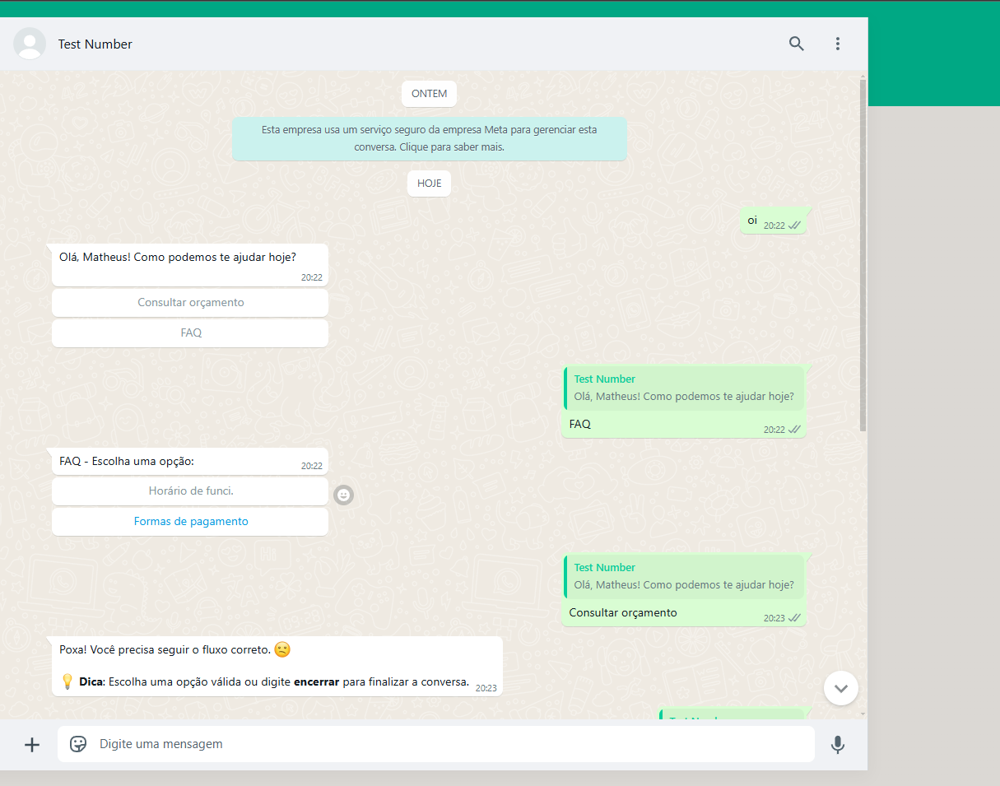
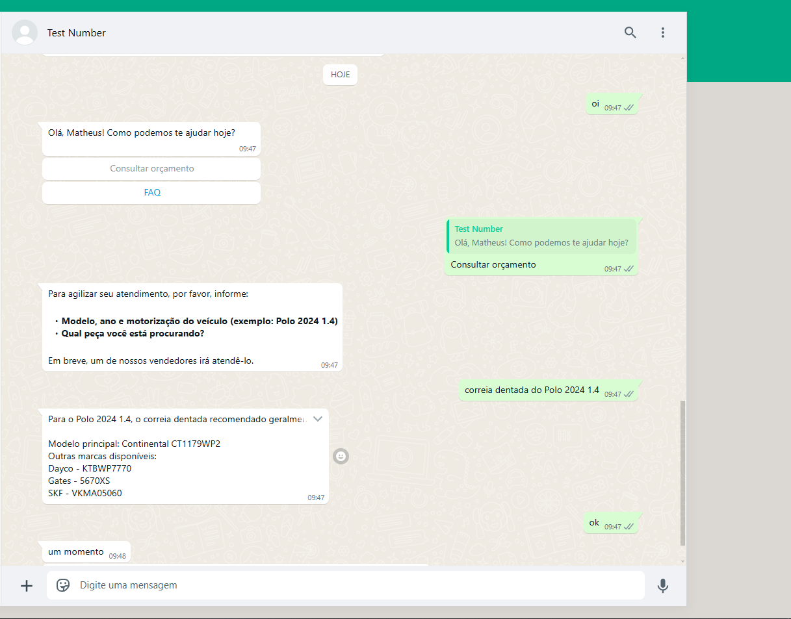
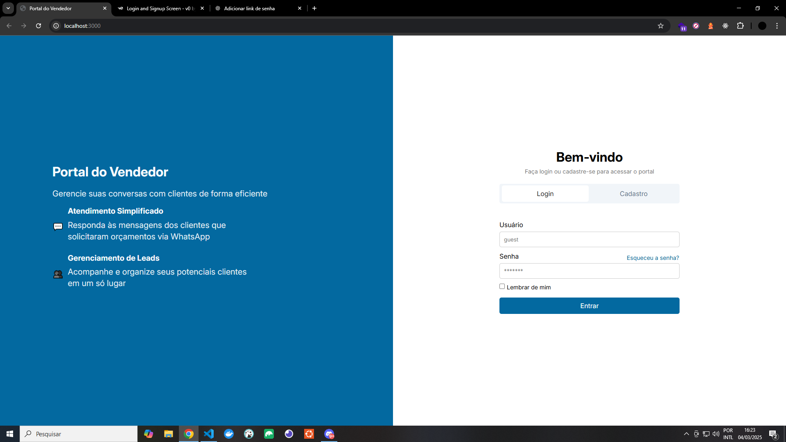
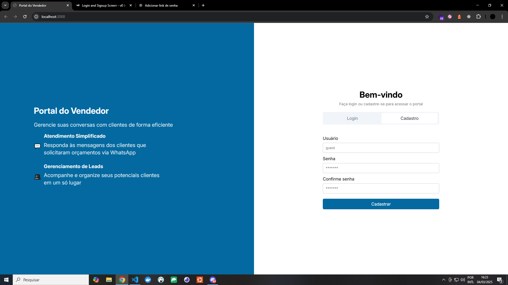

[](https://twitter.com/t_h_e_u)
[](https://www.linkedin.com/in/matheusgbatista/)
[](https://t-heu.github.io)

# WPP Bot Ecommerce

Automatize seu atendimento no WhatsApp com o WPP Bot Ecommerce.

## 🖼️ Preview






- Encerra conversa por inatividade
- Evita cliente tentar sair do fluxo da conversa

## 📌 Configuração do Ambiente (.env)

Crie e configure o arquivo .env com as seguintes vari√°veis:
```
Meta_WA_accessToken=
Meta_WA_SenderPhoneNumberId=
VERIFY_TOKEN_SECRET=testwpp
```

## 🚀 Configuração do NGROK e Servidor

1. Instale as dependências do projeto:
```
npm install
```

2. Exponha seu servidor local com o NGROK:
```
ngrok http 3000
```
O NGROK fornecer√° uma URL semelhante a:

https://abc123.ngrok.io -> http://localhost:3000

3. Inicie o servidor local:

```sh
npm run start
```

## 🔗 Configuração do Webhook (Meta)

Configure o Webhook para integrar com a API do WhatsApp.

1. No campo "URL de callback", insira a URL gerada pelo NGROK seguida do endpoint /webhook:

Exemplo: `https://abc123.ngrok.io/webhook`

2. No campo "Verificar token", defina uma chave secreta:

Exemplo: `testwpp`

3. Ative a opção "messages" para permitir o processamento de mensagens.

4. Para testes, adicione seu número em Configuração de API > "Até".

Agora seu bot est√° pronto para ser utilizado!
